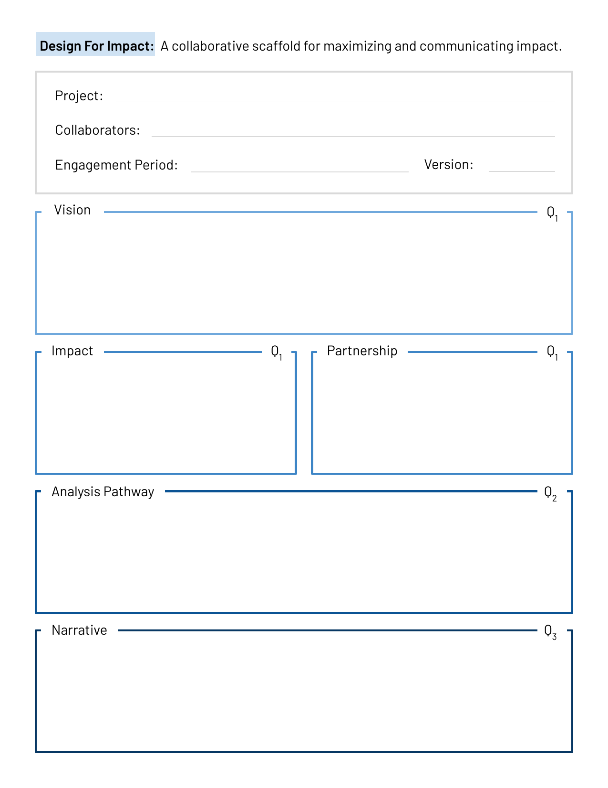

<section class="tool-page-hero" aria-labelledby="tool-page-heading">

::::: {.page-shell .tool-hero-grid}
::: tool-hero-copy
<h1 id="tool-page-heading">The Tool</h1>

Design For Impact turns alignment, intentionality, and translation into a practical process for statistical collaboration.

<a class="button button-primary" href="files/design-for-impact-tool-and-guide.pdf" download>Download the Tool + Guide</a>

The download includes the blank tool followed by implementation prompts for each component. It is currently provided as a printable PDF.

:::

<figure class="tool-artifact-preview">

::: tool-preview-frame

:::

<figcaption>The five components are designed to be revisited as an engagement develops.</figcaption>

</figure>
:::::

</section>

<section class="tool-components-section" id="five-components" aria-labelledby="components-heading">

::: page-shell
::: section-intro
<h2 id="components-heading">Five components connect purpose, analysis, and action.</h2>

Each component supports a different part of the work while keeping the intended impact in view.

:::

<article class="component-panel component-vision">
<h3>Vision — Q1</h3>

The long-term goal this collaboration will help advance for the organization or team.

Questions to consider:

<ul>
<li>If this work were exceptionally successful, what contribution would it make to society or the bottom line?</li>
<li>What purpose, cause, or belief motivates the project?</li>
<li>What long-term outcome will serve as the guiding light?</li>
</ul>
</article>

<article class="component-panel component-impact">
<h3>Impact — Q1</h3>

The people this work will serve and the decisions or actions the evidence will enable.

Questions to consider:

<ul>
<li>Who will be affected by this work beyond the immediate collaborators?</li>
<li>How will stakeholders use the evidence?</li>
<li>Which decisions or actions should the work support?</li>
</ul>
</article>

<article class="component-panel component-partnership">
<h3>Partnership — Q1</h3>

The expectations and motivations each collaborator brings to a successful working relationship.

Questions to consider:

<ul>
<li>What does each collaborator hope to gain and contribute?</li>
<li>What are the expectations for scope and timeline?</li>
<li>Are there expectations involving compensation, authorship, or ownership?</li>
</ul>
</article>

<article class="component-panel component-pathway">
<h3>Analysis Pathway — Q2</h3>

A shared plan for gathering evidence that will enable the intended impact.

Questions to consider:

<ul>
<li>What do stakeholders seek to understand, compare, explain, or predict?</li>
<li>Which study design, dataset, model, or visualization best meets those needs?</li>
<li>How does the planned analysis connect back to the intended impact?</li>
</ul>

<strong>If the pathway changes substantially, document what was learned in Narrative and begin a new version of the tool.</strong>

</article>

<article class="component-panel component-narrative">
<h3>Narrative — Q3</h3>

The concise, evidence-based story of how the analysis contributed to the vision, impact, or partnership.

Questions to consider:

<ul>
<li>What is the key takeaway?</li>
<li>Who needs to hear it, and how should it be tailored?</li>
<li>How do the findings enable a decision or action?</li>
<li>Which direct or indirect stakeholders should be considered?</li>
</ul>
</article>

:::

</section>

<section class="tool-section implementation-panel" id="flexible-implementation" aria-labelledby="implementation-heading">

::: page-shell
::: {.section-intro .tool-split-heading}
<h2 id="implementation-heading">A scaffold, not a script.</h2>

Use the tool as a shared document between you and your collaborator, or adapt it to your needs.

:::

<article>
<h3>Use the full artifact</h3>

Complete and revise the document collaboratively throughout the engagement.

</article>

<article>
<h3>Integrate selected components</h3>

Bring relevant prompts into scoping conversations, intake forms, meeting agendas, statements of work, or project notes.

</article>

<article>
<h3>Use it as a mental model</h3>

Apply Vision, Impact, Partnership, Analysis Pathway, and Narrative without requiring collaborators to interact directly with the artifact.

</article>

Partial implementation can still improve alignment and intentionality.

:::

</section>

<section class="tool-section" id="throughout-project" aria-labelledby="project-heading">

::: page-shell
::: section-intro
<h2 id="project-heading">Throughout the project</h2>

Use the tool as a lightweight record of the thinking that connects one phase of collaboration to the next.

:::

<ol class="project-sequence">
<li>
<h3>Before kickoff</h3>

Review the guide and prepare questions about Vision, Impact, and Partnership. Treat preliminary entries as hypotheses to validate.

</li>
<li>
<h3>During or immediately after kickoff</h3>

Establish Q1 with collaborators and confirm that the artifact reflects a shared understanding.

</li>
<li>
<h3>Before substantive analysis</h3>

Develop an Analysis Pathway connecting the design, data, methods, and communication products to the intended impact.

</li>
<li>
<h3>During analysis</h3>

Use the tool as a pulse-check. Revisit Q1 and Q2 when limitations, findings, or collaborator feedback change the project. Preserve prior versions after substantive changes.

</li>
<li>
<h3>Before closeout</h3>

Draft a Narrative connecting the evidence to the stakeholders, decisions, or actions identified in Q1. Tailor separate Narratives when audiences have different needs.

</li>
<li>
<h3>During and after closeout</h3>

Validate the Narrative with collaborators and incorporate it into presentations, reports, executive summaries, handoff materials, or project records.

</li>
</ol>
:::

</section>

<section class="tool-section adaptation-section" id="ways-to-adapt" aria-labelledby="adapt-heading">

::: page-shell
::: section-intro
<h2 id="adapt-heading">Ways to adapt it</h2>

Implementation can be as formal or lightweight as an engagement calls for.

:::

<ul class="adaptation-list">
<li>Asking more vision- and impact-oriented questions during scoping</li>
<li>Incorporating components into an intake form or statement of work</li>
<li>Documenting tried-and-revised Analysis Pathways</li>
<li>Revisiting the tool during standing client check-ins</li>
<li>Drafting a one- or two-sentence impact Narrative before closeout</li>
<li>Using the structure privately in meeting notes when a shared artifact is impractical</li>
</ul>

Not every project needs every approach.

:::

</section>

<section class="tool-section instructor-section" id="instructor-resources" aria-labelledby="instructor-heading">

::: page-shell

<h2 id="instructor-heading">Teaching Design For Impact</h2>

Instructor materials are in development, including presentation materials and a complete lesson or workshop plan. In the meantime, instructors may use the Tool + Guide and completed examples to introduce impact-centered statistical collaboration.

<a class="text-action" href="examples.qmd">Explore the Examples [→]{aria-hidden="true"}</a>

:::

</section>

<section class="tool-download-section" aria-labelledby="download-heading">

::: page-shell
<h2 id="download-heading">Plan for impact throughout your next collaboration.</h2>

<a class="button button-primary" href="files/design-for-impact-tool-and-guide.pdf" download>Download the Tool + Guide</a>
:::

</section>
